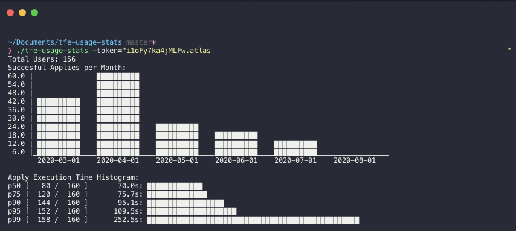

# TFE Usage Stats

```
./tfe-usage-stats -host="https://app.terraform.io" -token="" --gen-workspace-owner-sheet=true --organization=""
```
# Optional Flags

Generate Workspace Owners Sheet will generate a spreadsheet in the current directory that lists out all the team/workspace relationships in the respective organizations

```
--gen-workspace-owner-sheet=true 
```

The Organization flag will limit the scope to a specific organization. This can help with really large deployments of TFC/E

```
--organization="tfc-peyton"
```

# Example

<p align="center">
    
</p>

# Build

```
go build cmd/tfe-usage-stats.go
```

# Packaging

```
GOOS=windows GOARCH=amd64 go build -o bin/windows/tfe-usage-stats.exe cmd/tfe-usage-stats.go
GOOS=darwin GOARCH=amd64 go build -o bin/mac/tfe-usage-stats cmd/tfe-usage-stats.go
GOOS=darwin GOARCH=arm64 go build -o bin/mac-arm/tfe-usage-stats cmd/tfe-usage-stats.go
GOOS=linux GOARCH=amd64 go build -o bin/linux/tfe-usage-stats cmd/tfe-usage-stats.go

cd bin/windows && zip Windows.zip tfe-usage-stats.exe && cd ../..
cd bin/mac && zip Mac_x64.zip tfe-usage-stats && chmod +x tfe-usage-stats && cd ../..
cd bin/mac-arm && zip Mac_Arm.zip tfe-usage-stats && chmod +x tfe-usage-stats && cd ../..
cd bin/linux && zip Linux.zip tfe-usage-stats && chmod +x tfe-usage-stats && cd ../..
```